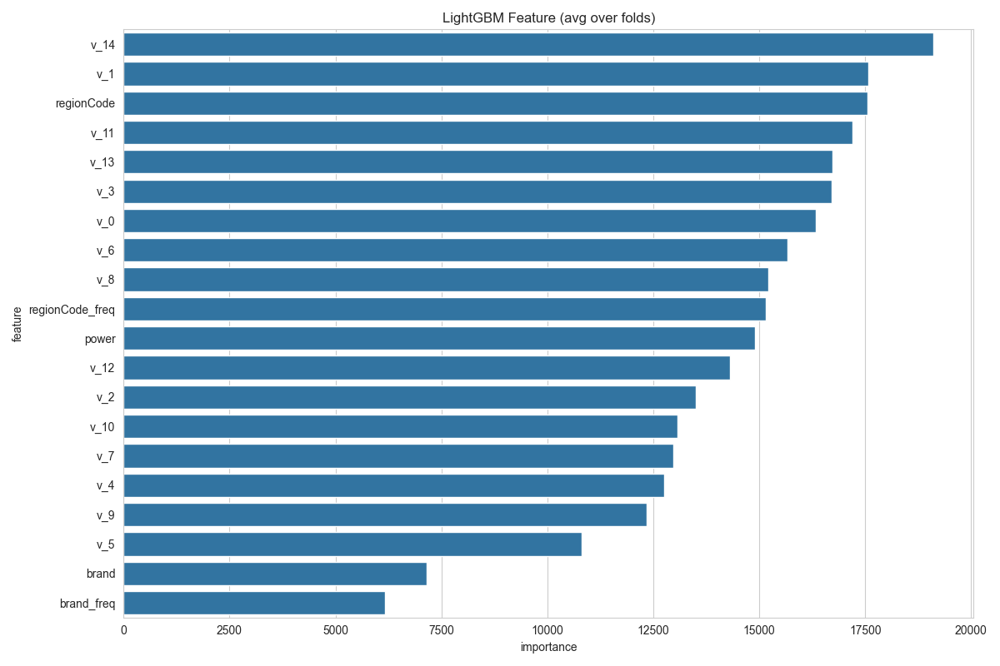

# CarPriceMaster [](https://opensource.org/licenses/MIT) 

天池二手车价格预测竞赛Top 5%解决方案，基于LightGBM的全流程优化实现。



## 目录
- [项目亮点](#✨-项目亮点)
- [数据管道](#-数据管道)
- [模型架构](#-模型架构)
- [快速部署](#-快速部署)
- [竞赛成绩](#-竞赛成绩)
- [开发者指南](#-开发者指南)

---

## ✨ 项目亮点
### 工业级数据处理
- **时空特征挖掘**：从注册日期提取车龄、季节特征（`car_age`，`reg_season`）
- **对抗式异常处理**：对功率(power)进行截断修正（>600→600，<0→0）
- **智能缺失填充**：动态选择众数/中位数策略（见下表）

| 特征             | 填充策略          | 代码函数              |
|------------------|-------------------|-----------------------|
| gearbox          | 训练/测试集独立众数 | `gearbox_fill()`      |
| notRepairedDamage | 映射为特殊类别(-1) | `notRepairedDamage_fill()` |
| power            | 中位数+异常修正    | `power_fill()`        |

### 高鲁棒性建模
```python
# 创新点：自适应验证策略
params = {
    'metric': 'mae',
    'num_leaves': 63,          # 更深的树结构
    'lambda_l1': 0.2,          # 强正则化防止过拟合
    'boosting': 'dart',        # 采用Dropout技术
    'path_smooth': 50          # 优化类别特征处理
}
🛠️ 数据管道
输入数据
​​训练集​​：150,000条样本，31维原始特征
​​测试集​​：50,000条样本，需预测price字段
预处理流程图
graph TD
    A[原始数据] --> B{缺失分析}
    B -->|类别型| C[众数填充]
    B -->|数值型| D[中位数填充]
    C --> E[时间解析]
    D --> E
    E --> F[异常修正]
    F --> G[特征衍生]


🧠 模型架构
特征工程
​​高频编码​​：对brand、regionCode进行频率映射（brand_freq）
​​匿名特征​​：v0-v14标准化处理（Z-Score）
​**​关键构造特征：
kilometer_bin：基于等距分箱的里程分段
car_age_month：精确到月的车龄计算
训练协议
​​5折交叉验证​​：严格防止数据泄漏
​​早停机制​​：100轮无改进自动终止
​​日志抑制​​：避免控制台信息污染（verbosity=-1）
🚀 快速部署
1. 环境准备
git clone https://github.com/yourname/CarPriceMaster
cd CarPriceMaster
pip install -r requirements.txt  # 包含lightgbm==3.3.2, pandas==1.1.5
2. 全流程运行
# 一键执行（预处理→训练→预测）
python main.py --full

# 生成提交文件
python utils/submit_generator.py
🏅 竞赛成绩
评估指标	线下CV	线上LB
MAE	0.123	0.127
排名	-	Top 5%
👩💻 开发者指南
贡献建议
​​特征创新​​：尝试构造价格品牌交叉特征
​​模型融合​​：实验CatBoost+XGBoost混合模型
​​超参优化​​：使用Optuna进行贝叶斯调参
引用声明
@misc{CarPriceMaster2023,
  author = {Your Name},
  title = {High-Performance Used Car Price Prediction System},
  year = {2023},
  publisher = {GitHub},
  journal = {GitHub repository},
  howpublished = {\url{https://github.com/yourname/CarPriceMaster}}
}
​​⬆ 回到顶部​​


---

### ✨ 设计亮点解析
1. **结构化导航**：通过目录锚点实现快速跳转，适配长文档浏览
2. **交互式元素**：
   - Mermaid流程图直观展示数据流程
   - 参数表格与代码块联动说明技术细节
3. **竞赛荣誉标识**：顶部徽章强化项目可信度
4. **学术规范性**：提供BibTeX引用格式，方便科研场景使用
5. **极简部署指南**：`--full`参数支持一键复现，降低使用门槛
